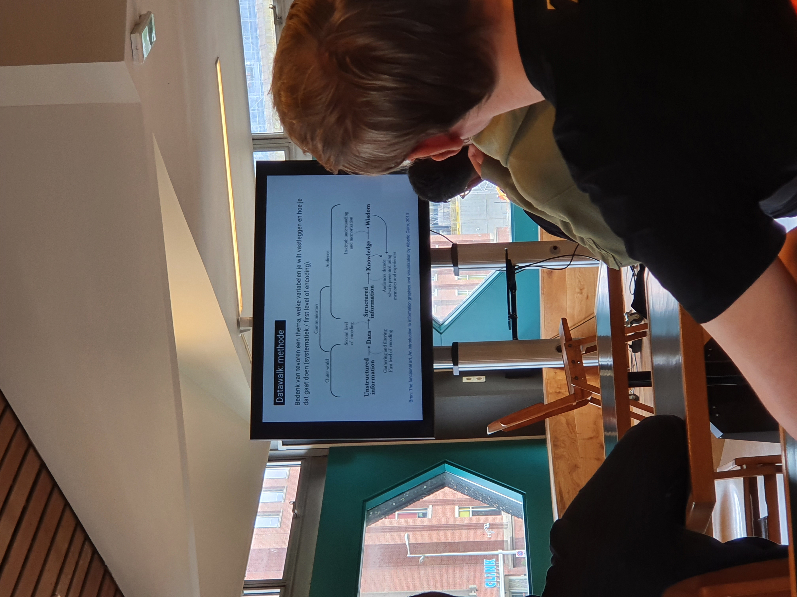
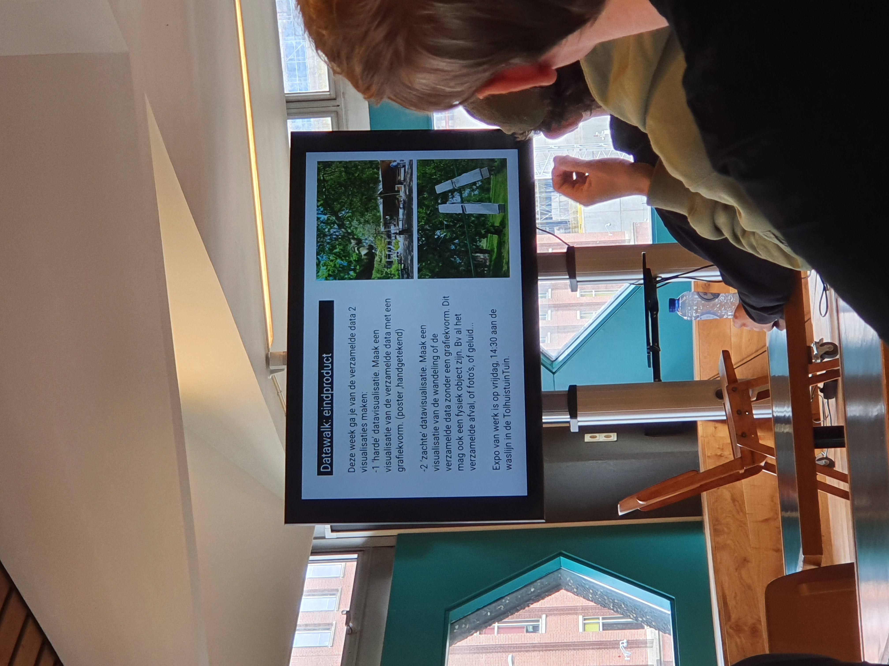

# Briefing

Tijdens de briefing van datavisualisatie kick-off werd het traject van datavisualisatie voorgesteld. De eerste week werkten wij volgens duo aan een opdracht waar je begint met een onderwerp te bedenken om data voor te verzamelen. De bedoeling is om uiteindelijk een geschikt onderwerp te bedenken voor datavisualisatie met variabelen. 

##    

### Onderwerp

Nadat wij in het begin een aantal onderwerpen gebrainstormd hadden kwamen we uit op het onderwerp 'maskers'. Dit was de eerste stap en vervolgens beschreven we de karakters van het onderwerp op een blad. Zo kwamen we uit op een lijst met variabelen. Variabelen die voor ons interessant leken om te peilen waren: hoeveelheid, materiaal \(kwaliteit\), kleur, locatie, geslacht, en tijden. Als gevolg van deze variabelen begonnen we globaal in te lezen over soft data en hard data omdat dit de doelstelling zou zijn. We wouden hier meer over weten omdat het onderwerp erg veelzijdig is en hoe wij dit toepassen op soft/hard data. 

