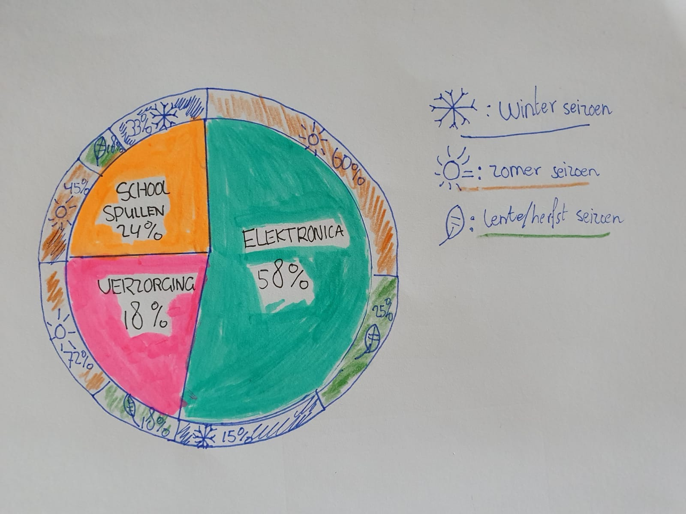

# Categorical uitgewerkt

  
**Fig.1 Categoriek diagram van seizoen en objecten**

**Pros**  
Makkelijk te lezen en vervolgens induiken voor de toeschouwer  
Bied mogelijkheden voor meerdere variabelen en uit te breiden  
Interessant om te vergelijken wat voor seizoen andere aankopen relevant zijn

**Cons**  
Kan ingewikkeld worden met uitbreiden  
Een histogram is meer doeltreffend  
  
  
 

