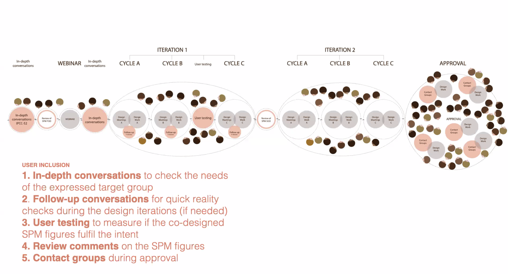

# Angela Morelli

Het meest interessante na het luisteren naar Angela Morelli was voornamelijk de impact die zij heeft met haar rol als Information designer. Wat ik vooral hoorde hoe zij information kan inzetten om een verschil uit te maken. Dat vond ik vooral erg waardevol in haar conferentie. Morelli is een award-winnaar die zich inzet voor klimaat verandering, en gezondheid. Ze had veel samenwerkingen die zij introduceerde. 

Wat ik vooral een aspiratie in haar vind is het mensen aansporen, en de keuzes maken om iets doeltreffend te communiceren. Haar presentatie was vooral met de bedoeling 'Design for impact'. Dit brengt veel meer impact. Dit leerde mij daarom ook om technologie tot veel meer in te kunnen zetten, en dus ook wat je met datavisualisatie kan communiceren. 

 

\*\*\*\*

