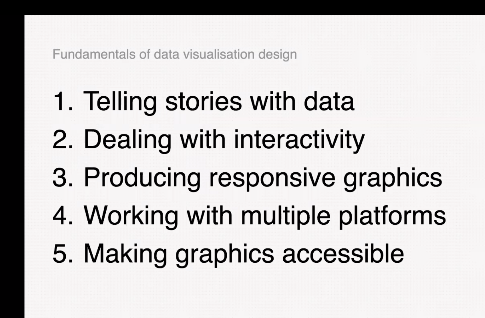

# Jane Pong

Jane Pong starte de opening van de conferentie met een introductie van haarzelf. Zij was direct voor mij een van de meest interessante sprekers omdat zij na haar introductie de aandacht trok. Namelijk de impact die zij heeft met haar functie als data visualisation journalist was ik erg geboeid. Ze is journalist bij Financial Times aan de andere kant van de wereld, ze heeft belangstelling voor het vak. Zij is bezig met het visualiseren van verhalen samen met patronen in data graphs. Ik vind haar werk bijzonder omdat ze aangaf een nieuwe stijl te geven aan wetenschappelijke data. Met een artistieke interpretatie gebaseerd op data, het belang van de 'fundamentals', zoals Jane het zelf noemt. 

Ik heb van deze spreker het meest geleerd omdat zij duidelijke punten verteld die ik kan toepassen. Namelijk het belang van informatie daadwerkelijk overbrengen, dat is namelijk lastig. Hierbij deze 'fundamentals', waar ik vooral van heb geleerd. Omdat dit mij helpt met het visualiseren van data en waar ik data goed op kan baseren vooral. 

 

