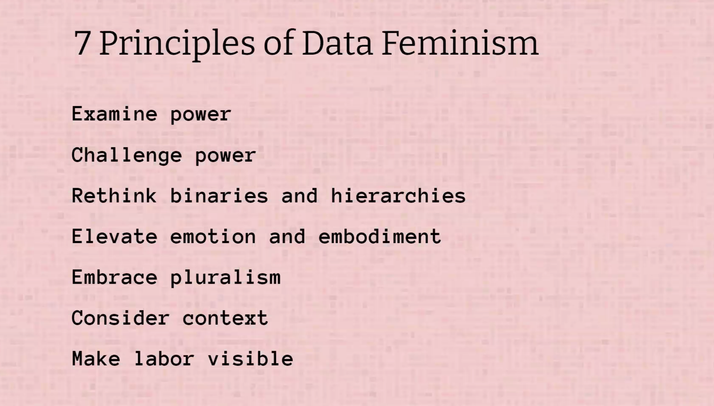

# Lauren Klein

In de presentatie van Lauren Klein was het onderwerp 'Data feminism'. Alhoewel ik het onderwerp kan begrijpen was ik met deze spreker niet echt geboeid. Toch probeer ik ervoor open te staan en het belang te zien. Eenmaal aangezet tot de materie begrijpen begreep ik dat haar inzet draait om gelijkheid, effectieve data gebruiken om mensen te openbaren. Ik vond het wel interessant, omdat ze toch een paar principes voorstelt dat over data science gaat. Een onderwerp waarvan elk veld belangrijk is, en dat iets verandering kan brengen door data science. 

In ieder geval heeft ze het over de consequenties binnen deze data. Hoe wij menselijke data en faciliteren en activism kunnen gebruiken om uitdagingen voor gelijkheid aan te gaan. 

 

