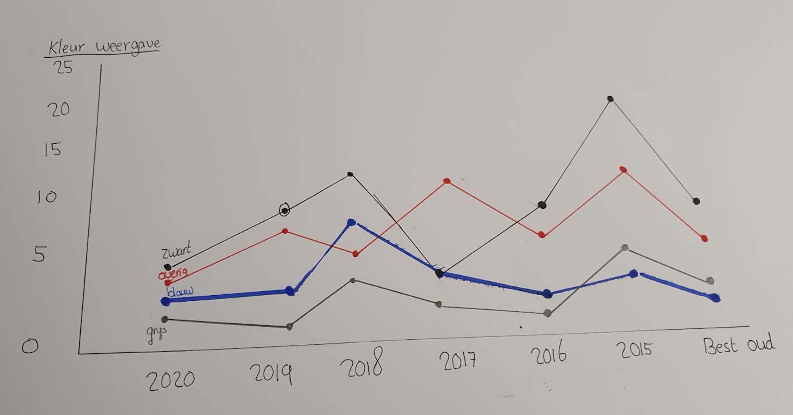

# 3. Toekennen van attributes en ordening

 

**Fig.5 Kleur weergaves en variabelen**

De grafiek heb ik samen met variabelen toegepast. Dit leek mij een goede indeling omdat veel van de objecten te maken hebben met kleur. 

