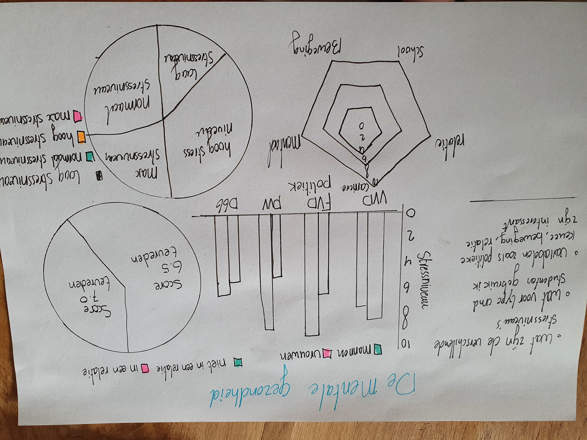
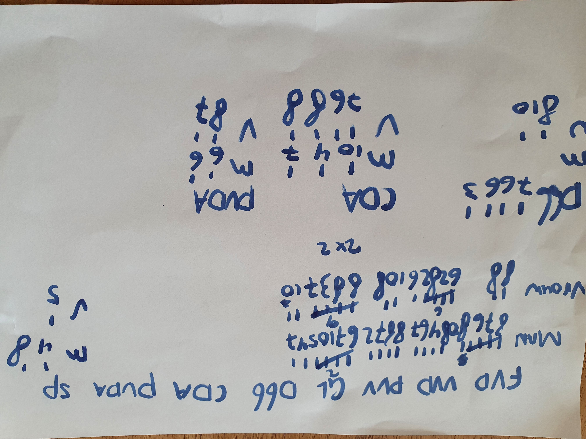
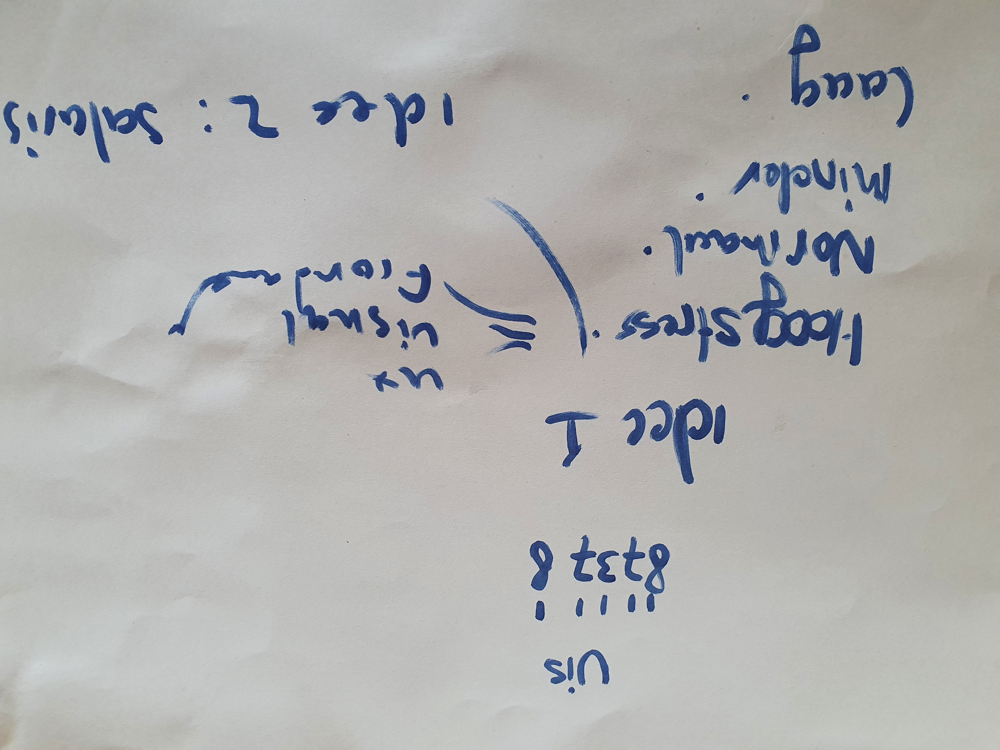
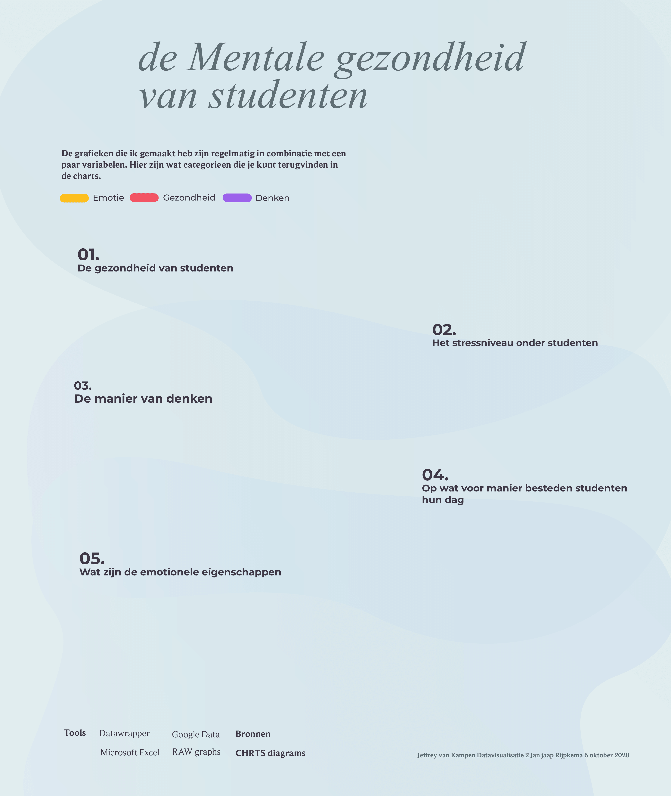

# Infographic methode

Nadat ik de theorie nogmaals heb herzien kon ik de data beter toepassen. Aangezien het voor mij nu belangrijk was om de data realistisch en informatief te maken om een dergelijke bias te voorkomen. Maar het is eenmaal wel dat het onderwerp mentale gezondheid ingewikkeld kan zijn. Toch ben ik van mening dat ik een interessante uitkomst op mijn onderzoek heb kunnen krijgen. 

Nadat ik een eerste opzet heb kunnen maken heb ik feedback ontvangen op mijn poster. Het kwam voornamelijk naar voren dat ik moest kijken welke grafieken het meest toepasselijk kunnen zijn voor mijn data. Aangezien de data die ik onderzocht heb ook redelijk breed is. Ik ga ook van informatieve data naar soms meer open data zoals relaties, geld en politiek. Maar het zijn belangrijke factoren voor de vergelijking met het stressniveau.  

Hier zie je de eerste opzet van mijn infographic maar de grafieken heb ik meerdere keren gewijzigd om te testen wat duidelijker is voor mijn data. Ondertussen heb ik makkelijke schetsen gemaakt die experimenteel zijn waarin ik kijk naar stressniveau, gezondheid en interessante variabelen. Dit hielp mij goed op weg. Later pas ik de grafieken veel aan en kies ik regelmatig andere variabelen of grafieken voor in de plaats. Zo pas ik een doeltreffende en realistische infographic toe om zo dichtbij mentale gezondheid te komen.   
  
Hiernaast kies ik voor het gebruiken van andere variabelen om de encoding te verwerken. Uiteindelijk zie je wel de manier van werken en hoe ik veel data in orde probeer te krijgen. Hier zie je een kijkje van het proces en op de volgende pagina mijn infographic: 

  

Gebruikte tools:  
Flourish: [https://flourish.studio/](https://flourish.studio/)  
Datawrapper: [https://www.datawrapper.de/](https://www.datawrapper.de/)  
Tableau: [https://www.tableau.com/](https://www.tableau.com/)  
RAW graphs: [https://rawgraphs.io/](https://rawgraphs.io/)

