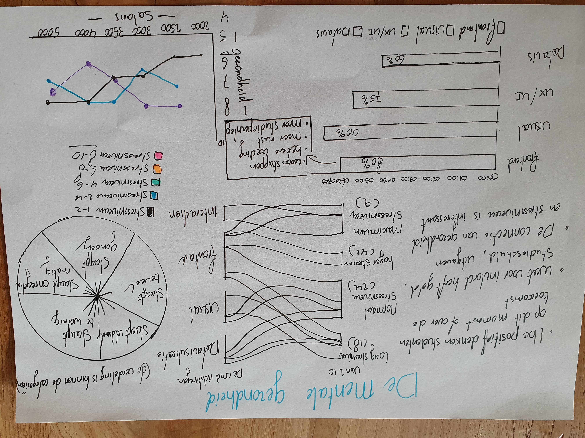

# Infographic methode

Nadat ik de theorie nogmaals heb herbekeken kon ik de data beter toepassen. Aangezien het voor mij nu belangrijk was om de data realistisch en informatief te maken om een dergelijke bias te voorkomen. Maar het is eenmaal wel dat het onderwerp mentale gezondheid ingewikkeld kan zijn. Toch ben ik van mening dat ik een interessante uitkomst op mijn onderzoek heb kunnen krijgen. 

Nadat ik een eerste opzet heb kunnen maken heb ik feedback ontvangen op mijn poster. Het kwam voornamelijk naar voren dat ik moest kijken welke grafieken het meest doeltreffend kunnen zijn voor mijn data. Aangezien de data die ik onderzocht heb ook redelijk breed is. Ik ga ook van informatieve data naar soms meer open data. 

Hier zie je de eerste opzet van mijn infographic maar de grafieken heb ik meerdere keren gewijzigd om te testen wat duidelijker en effectiever voor mijn data werkt. Hier zie je de vragen die ik eerst gebruik. Ondertussen heb ik hele makkelijke schetsen gemaakt en daarna de volgende tools gebruikt: 

Flourish: [https://flourish.studio/](https://flourish.studio/)  
Datawrapper: [https://www.datawrapper.de/](https://www.datawrapper.de/)  
Tableau: [https://www.tableau.com/](https://www.tableau.com/)  
RAW graphs: [https://rawgraphs.io/](https://rawgraphs.io/)

  

