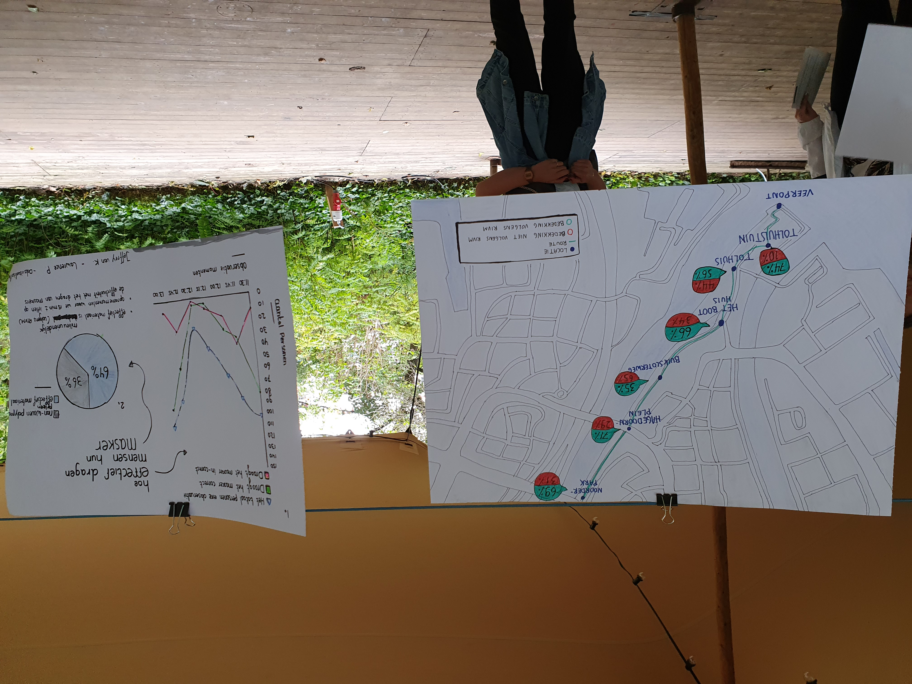

# Expo werk

  Tijdens het presenteren van ons werk waren er veel positieve reacties. Het is namelijk een relevant onderwerp, en inhoudelijk hebben wij laten zien dat deze data waardevol kon zijn. Omdat het weergeeft hoe effectief mensen hun maskers dragen. Het laat zien hoe bewust mensen hier mee bezig zijn.  En wat de algemene trends zijn, er is een complete weergave omdat het goed laat zien waar een groep mensen soms de noodzaak niet ziet om een masker te dragen bij een van onze bevolkte observatie locaties.  

Een verbetering in dit geval was vanuit soft data perspectief om een meer subjectieve weergave te laten zien met gebeurtenissen. En vanuit hard data perspectief de graphs met elkaar te linken, en waar de percentages op gebaseerd zijn. 

