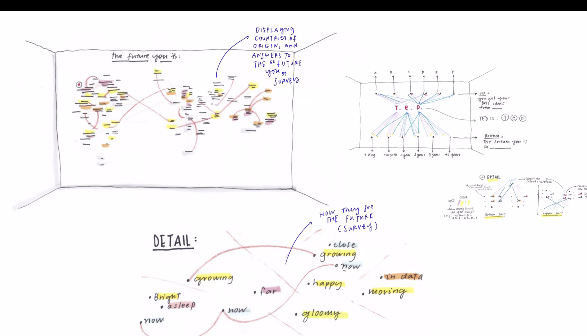

# Giorgia Lupi

In de introductie van Giorgia Lupi vertelde zij over wat haar benadering is met data. Zij vertelde in haar principes de uitdagingen van data aan te gaan, ontwerpen te maken door de embodiment van visuele verhalen. Giorgia is een information designer. Een creatief persoon die op een nuchtere manier \(blijkelijk\), data gebruikte voor haar ontwerpen. Statistieken met betekenis zoals verhalen, ideeën. In mijn ogen soms subjectieve gedachtes liet zien.    
  
Wat ik interessant vond in het verhaal van Giorgia is de innovatie die ze demonstreert in haar ontwerpen, creatief te zijn maar wel met een basis van data te gebruiken, soms mathematische data te laten mengen met creatieve kunst. Hiernaast vind ik haar manier van omgaan met data interessant, omdat 'data humanism' volgens haar niet alleen nummers zijn, maar ook menselijk, tastbaar kan worden benaderd. 'The human side of data' en 'data we don't see' sprak mij aan. 

 

