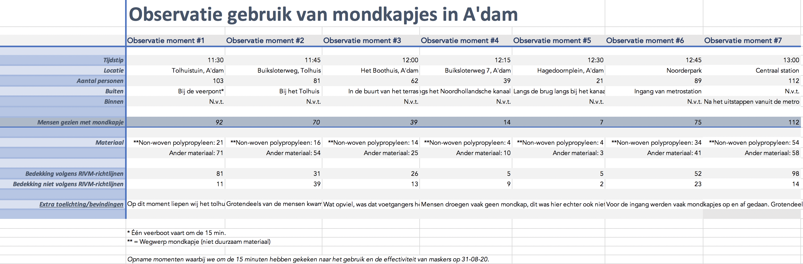

# Hard data

Nadat wij de route hebben gevolgd en onze data hebben gemeten volgens een systematische methode gingen wij de content verzamelen. De resultaten hebben wij op tafel gelegd, foto's en video's opnieuw bekeken en de route nagetrokken om de exacte locaties te mappen. Dit hebben we vervolgens in Excel toegevoegd. Nadat we de data in excel toegevoegd hadden gingen we de variabelen organiseren, zo kunnen we zien wat de inhoud van de grafiek is en hoeveel grafieken hier eventueel nodig voor zijn.  

 

Hier zie je een tabel met de opnames van de 7 observaties. Hier hebben wij 7 variabelen namelijk:          Tijdstip, locatie, personen, buiten of binnen, materiaal, bedekking wel of niet volgens RIVM en onze bevindingen. 

Zoals je wellicht uit de tabel kunt halen is dat wij bij elke observatie ongeveer 15 minuten gingen onderzoeken. Elke 15 minuten aan observatie kwam het aantal personen naar voren die wel of niet een masker dragen. Dit werd vooral bepaald door de route voorafgaand, waar een masker soms vanzelfsprekend zou zijn. Toch kun je uit de tabel zien, dat het aantal mensen met bedekking soms aanzienlijk veranderd, niet ver van sommige verplichte zones vandaan. 

          

