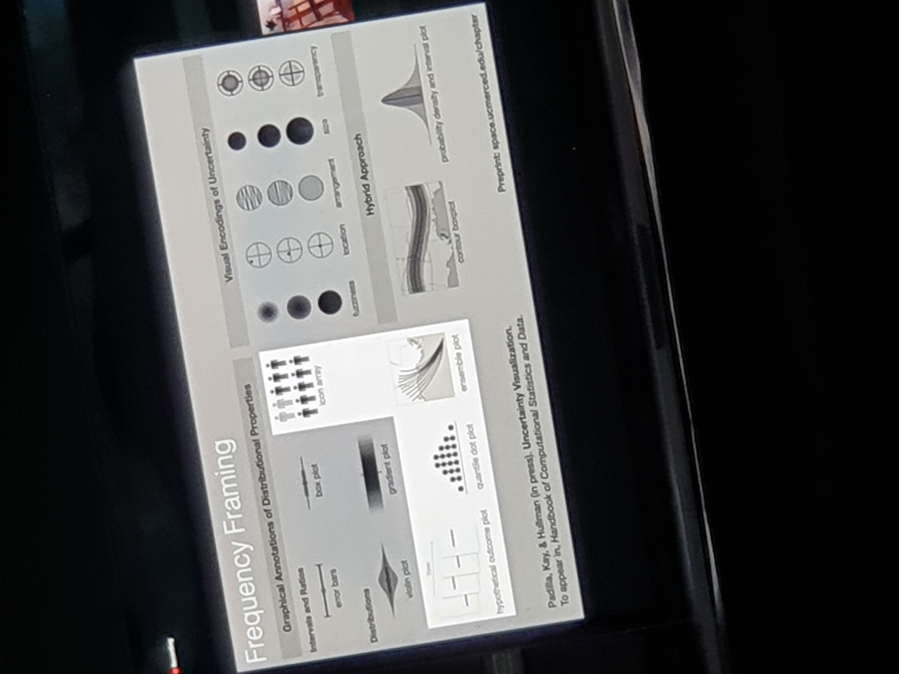

# Lace Padilla

Even sterk als de talk van Jane Pong heeft Lace Padilla een indruk op mij gemaakt met haar toewijding aan wetenschap, research en beslissingen maken op wetenschappelijke en statische waarde en de impact van informatie. Saving the best for last zou ik denken. Lace Padilla is een professor in wetenschap met haar onderwerp over 'Uncertainty Visualizations' in de talk. 

Wat ik vooral interessant vond in deze talk was de waardevolle inbreng om data te leren kennen. Zo heb ik in data bepaalde functies geleerd zoals probability, intervals, frequency en hoe deze functies omgaan met Uncertainty Visualizations. Hoe ons brein, of data lezen als grafieken zoals haar voorbeeld met de grafieken over een orkaan voorspelling. Dus hoe wij omgaan met uncertainty, en data dit minder complex maakt. Dit vond ik interessant omdat ik de functies die ik beschreef kan toepassen. Door exacte data te kunnen maken in grafieken. Probability te ontwikkelen met deze data. Deze talk gaf mij meer kennis om data precies en representatief te maken. 

 

