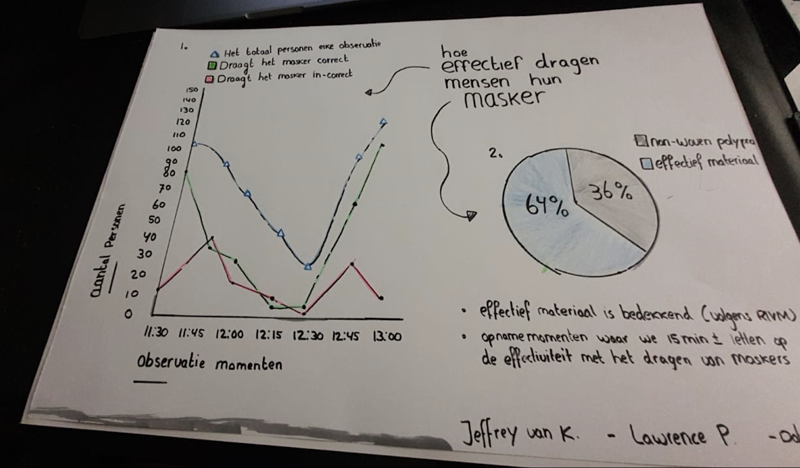

# Hard data

Nadat de Excel tabel klaar was gingen we aan de slag met het brainstormen van verschillende grafieken. Grafieken zoals een lijndiagram, histogram of cirkeldiagram die het meest sprekend kon zijn over de data die wij hadden verzameld. Af te lezen uit de tabel, is te zien dat er veel data was. Dat is een uitdaging in een grafiek te doen omdat het ingewikkeld kan worden voor de lezer of gebruiker.  

De keuze volgens het brainstormen voor de juiste grafiek is dus erg complex. Uiteindelijk kwam ik tot de conclusie dat een lijngrafiek geschikt is. Dit lijkt mij geschikt omdat ik meerdere progressieve lijnen kon bekijken via de observatie punten. Het is dus makkelijk af te lezen, het maakt meerdere variabelen duidelijk binnen ons onderwerp. En je leest hier bepaalde trends af.

Hiernaast maakte ik een cirkeldiagram om het materiaal dat gedragen werd duidelijker te maken. Tot slot zie je een overzicht wanneer mensen hun masker juist dragen met daarin de stijging of daling, evenals de mensen die het verkeerd droegen.   

 

