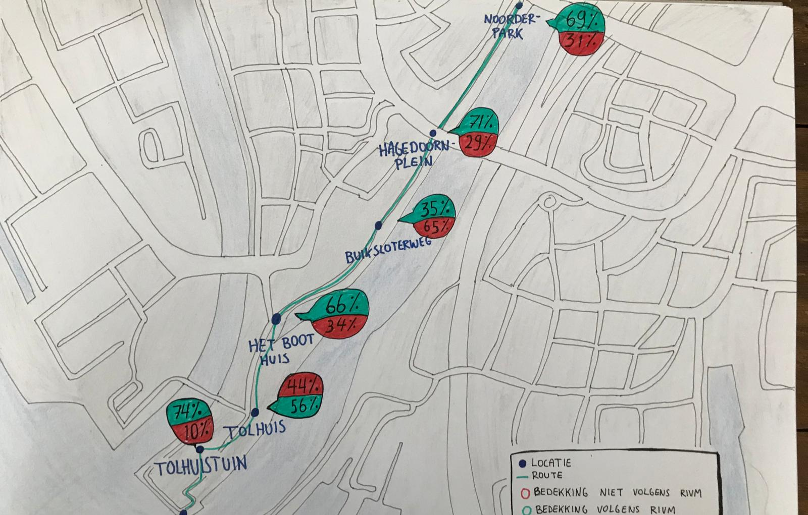

# Soft data

In dit format zie je de route die wij hebben gevolgd. Het visualiseert onze route met meer inleving, door de bezoeker een beeld van onze route en het onderzoek te weergeven. Deze grafiek is meer subjectief, minder letterlijk door allerlei metingen en cijfers. De percentages zijn nog wel gelinkt aan de hard data. In ieder geval leek dit ons geschikt om de route te mappen en zo een goed beeld te geven van ons onderzoek. Volgens de opdracht is dit wat meer zachte data, en makkelijk te verwerken volgens onze systematische manier van documenteren. 

