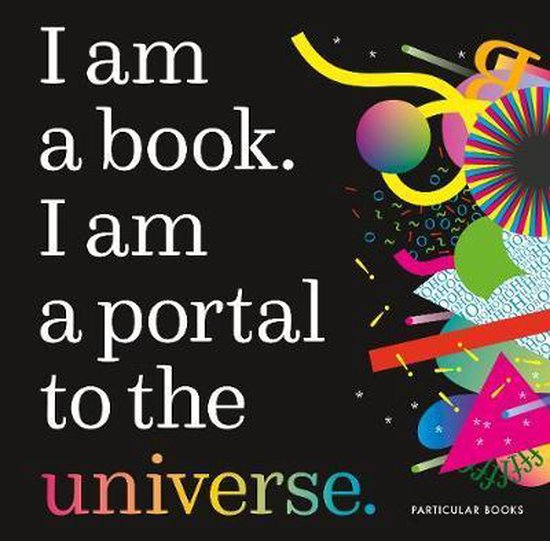

# Miriam Quick & Stefanie Posavec

De talk van Miriam Quick & Stefanie Posavec vond ik na een lange tijd pas interessant. Het was eerst vrij mysterieus maar mijn opvatting in hun spreking was hoe je kan communiceren met data in verhalen. Miriam is een data journalist, en researcher. Zij kwam erg toegankelijk over met luchtige besprekingen en de projecten die zij voorstelt samen met haar podcast. Zij maakt data verhalen in het kort. Stefanie is een ontwerper. Beiden kwamen over dat ze experimenteren met het gebruiken van data op een visuele manier en de inleving van mensen aan te spreken. Vooral met hun boek 'I am a book', ik vond deze spreking niet interessant. Maar ik heb van hun beide weel geleerd om te experimenteren, en hoe je data anders kan interpreteren. En hoe een verhaal een persoonlijkheid heeft? 

 

