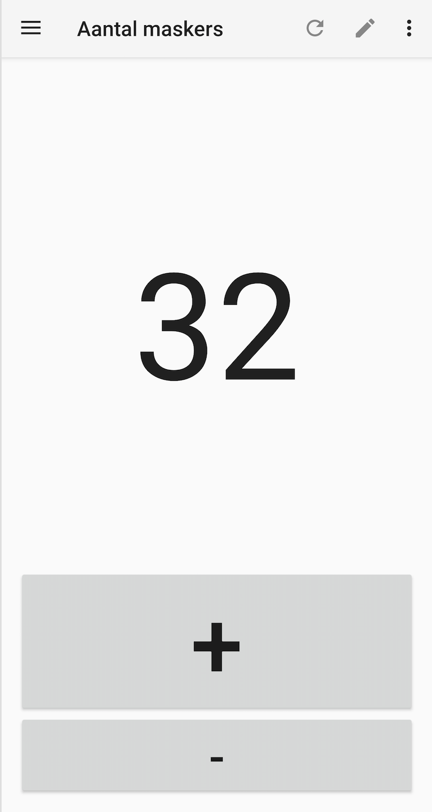
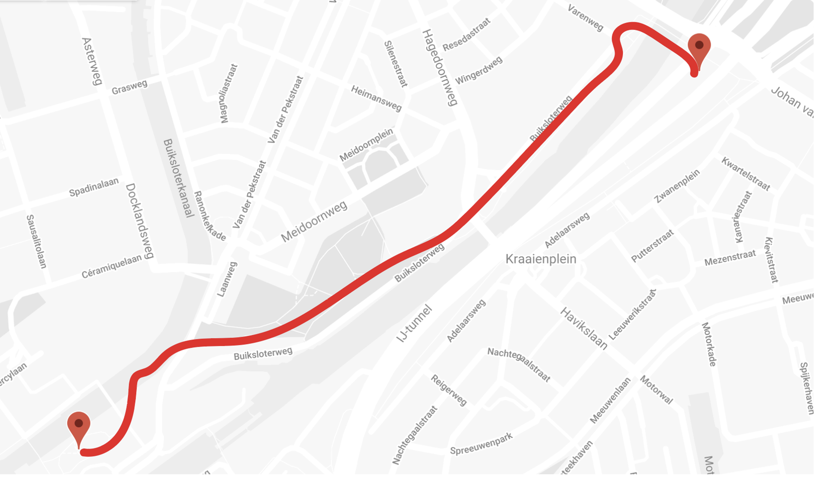

# Onderzoek

Vervolgens toen wij ons onderwerp hebben gekozen en een aantal variabelen hebben bepaald begonnen wij de data-walk om ons te verdiepen in het onderwerp. Wij begonnen eerst nog wat vragen op te stellen voordat wij de data-walk maakten. Onze hoofdvraag werd uiteindelijk: 

#### ' Hoe effectief dragen mensen hun masker?' 

Met deze vraag in gedachte te hebben starten wij de wandeling om onderzoek te doen. Om goed onderzoek te doen gebruikten wij een paar apps om de data de meten zoals de stappenteller om de locatie en route te bepalen. Daarnaast gebruikten wij een app om te turven. Wij hebben vanaf de Tolhuistuin tot de metro onze route bepaald en op 7 plekken geturfd naar de effectiviteit van het dragen van maskers. In dit geval of mensen hun masker volledig dragen of niet, en wat het materiaal is van hun maskers, wat hun nabijheid is en wanneer zij dit wel of niet op doen. Eigenlijk veel regels volgens het RIVM. Dit deden wij systematisch. 

##    

