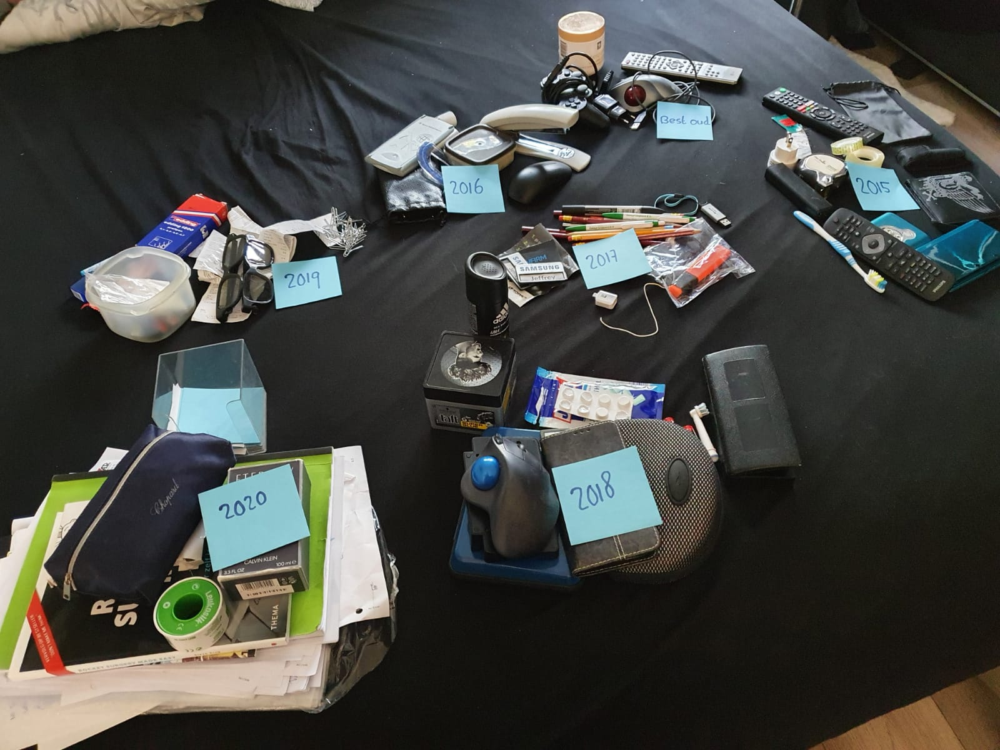

# 1. Ordening organisatie

_Jaartal van de items van recent naar minder recent. Zo kan ik onderscheid maken in dingen niet nuttig meer zijn. En een verzameling maken van de bruikbaarheid. Vervolgens wil ik dit   abstract weergeven in een grafiek om een goed overzicht te krijgen van mijn spullen._ 

 _**Fig.1 Objecten ingedeeld op tijd**_

