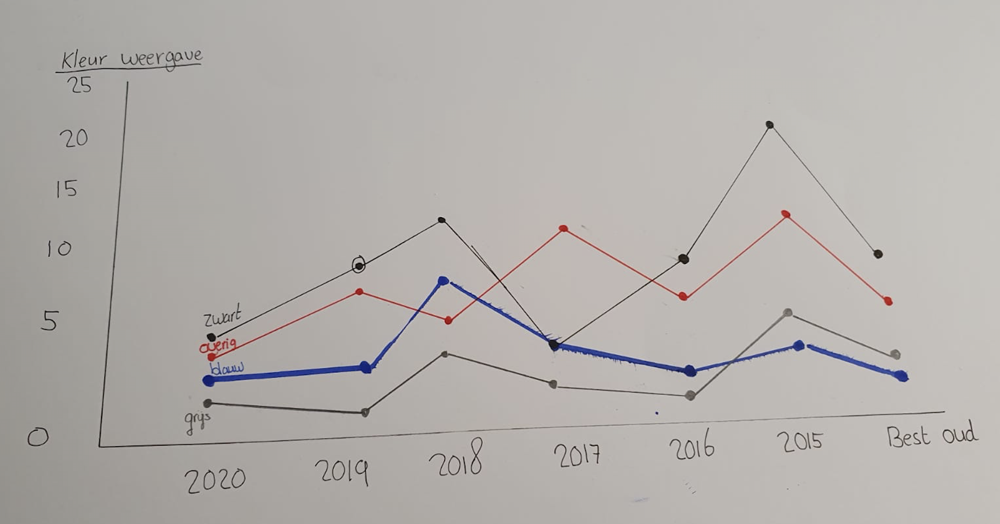

# 3. Toekennen van attributes en ordening

 

**Fig.5 Kleur weergaves en variabelen**

De grafiek heb ik samen met variabelen toegepast. Dit leek mij een goede indeling omdat veel van de objecten te maken hebben met kleur. Nadat ik de eerst vorm had gemaakt bepaalde ik categorieën \(en moest ik beter later meer encoding gebruiken en de assen definiëren. Zodat het duidelijker wordt en ook meer laat zien wat deze groepen precies voorstellen. 

