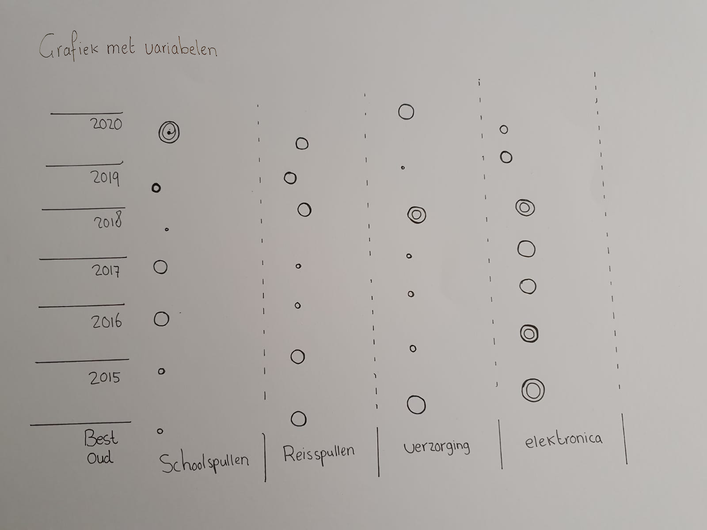
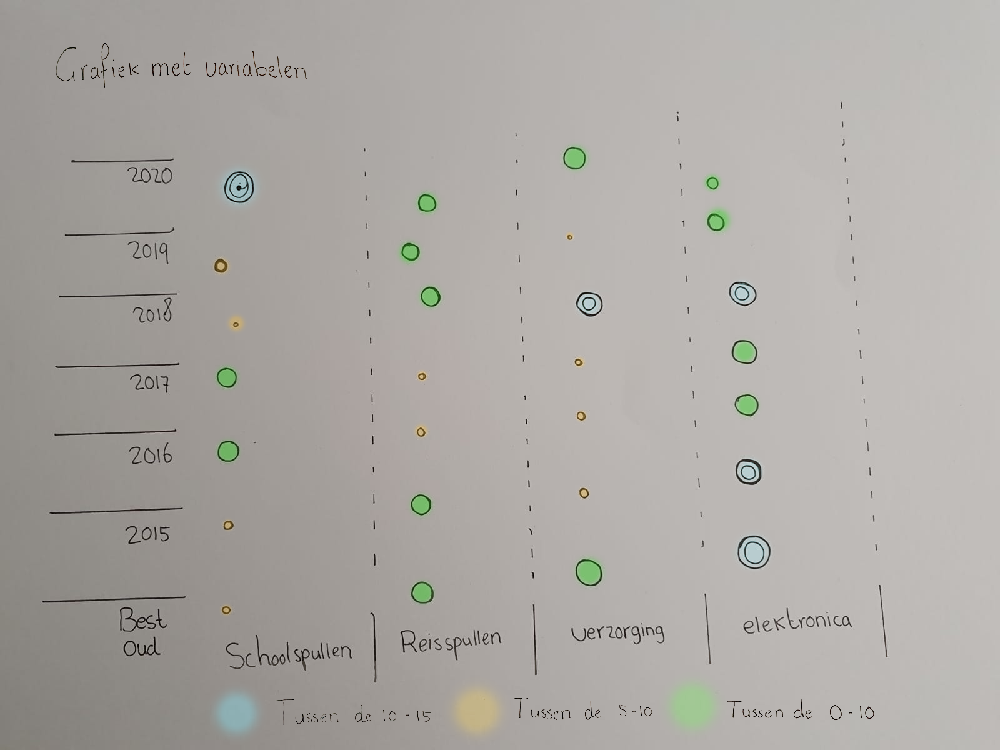

# 3. Toekennen van attributes en ordening

 Nadat ik een abstracte weergave had gemaakt van mijn bureaukast organisatie ben ik er achter gekomen dat ik te snel variabelen en encoding had gebruikt. Bij deze versie ging ik door met nadenken over de waardes van de groepen. 

Inmiddels had ik meerdere encoding manieren toegepast zoals grootte, kleur, positie. Het leek mij verstandig om eerst hierna een volgende grafiek te maken om de data meer representatief te maken. Maar deze weergave vond ik interessant omdat het duidelijk en snel afleesbaar is wat een aantal grote groepen zijn.  
  
**fig.3 Grafiek met variabelen** 

