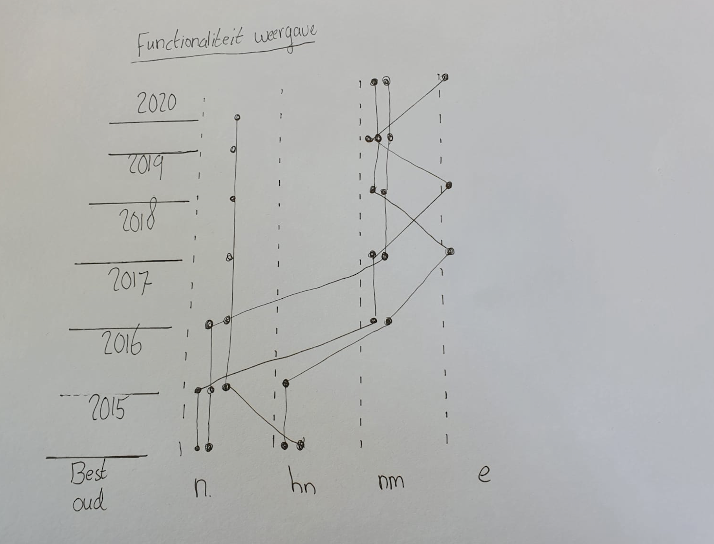

# 2. Abstraheren

In deze grafieken wil ik kijken naar de functionaliteit van mijn spullen, dus of deze nog bruikbaar zijn. En wat hun functie is, is het houdbaar of is het in de loop van de tijd niet meer waardevol. Zo kan ik weten of ik dit kan rangschikken en indelen in mijn bureaukast.

**Fig.6 Abstracte weergave functionaliteit**

