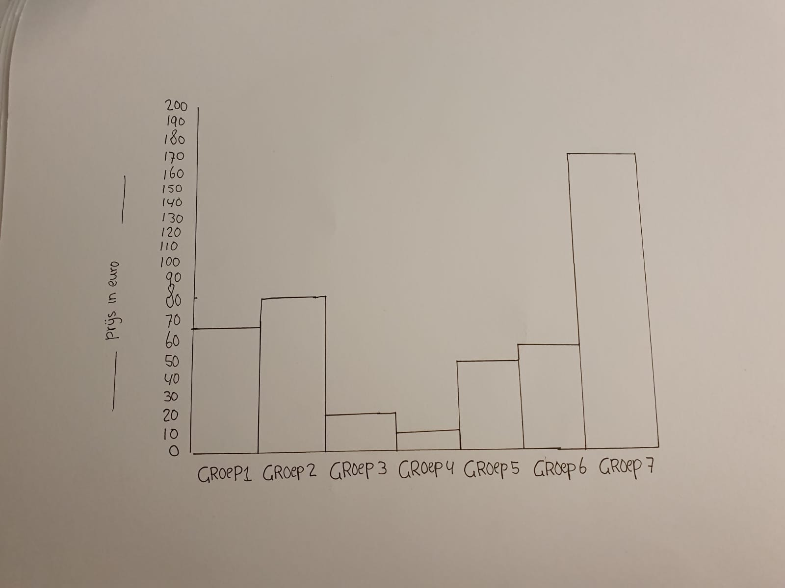

# 2. Abstraheren

 

**Fig.2 Abstracte prijsgroepen**

**Deze grafiek heb ik gemaakt omdat het een revisie is op een duidelijke manier van mijn organisatie. Het is nu met een categorische abstracte weergave gemaakt. Nog vrij leeg. Maar het idee is duidelijk en de rangschikking kan vrij interessant zijn om mijn spullen op waarde in te delen. In ieder geval weet ik zeker dat ik hier veel encoding voor kan toepassen.** 

\*\*\*\*

