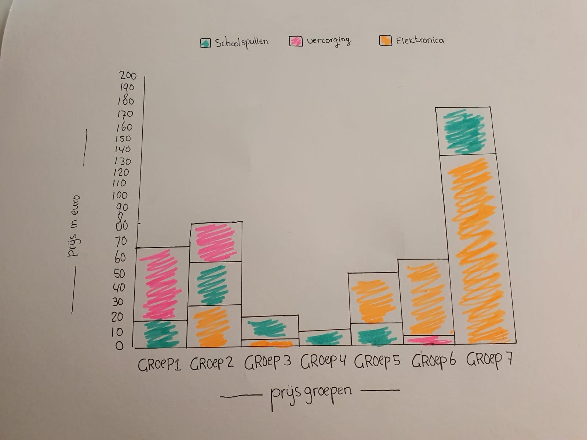
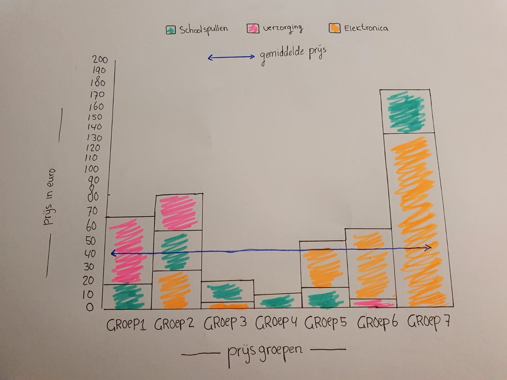

# 3. Toekennen van attributes en ordening

  
**Fig.3 Toegevoegde marks en attributen**

**Na de eerste revisie heb ik attributen gebruikt om de organisatie interessant te maken. De kleur representeert de data veel duidelijker. Ook is de functie van de grafiek veel meer bruikbaar. Tot slot kun je gemakkelijk zien waar de grootste groepen in zijn. Als laatste vond ik een constante lijn interessant om toe te voegen, later begreep ik dat dat niet perse een goede toevoeging was en ook niet volgens voorbeelden van Andy.   
  
  
Fig.4 Toegevoegde marks en attributen 2**

