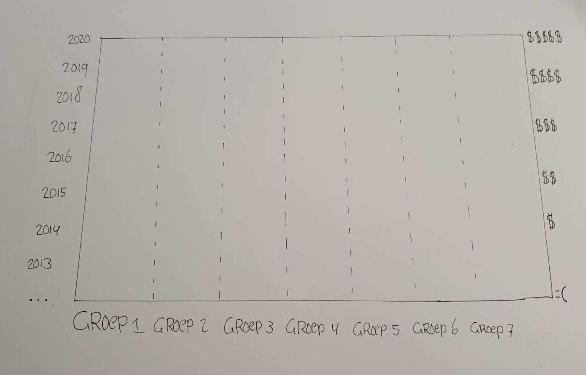
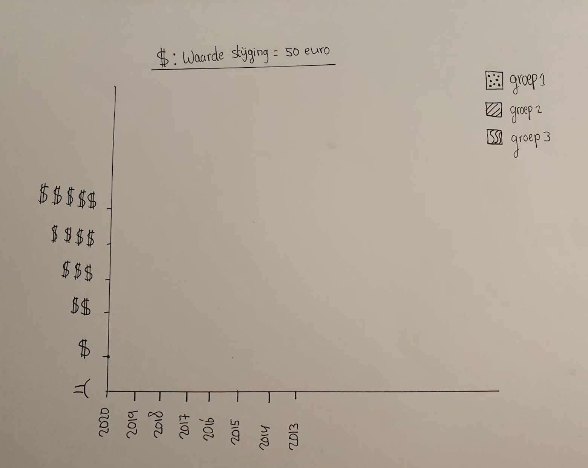

# 2. Abstraheren

  
**Fig.4 Abstracte iteratie 1**

**Met deze grafiek wou ik beginnen om te oefenen met de geschikte manier om data in te delen. Zo had ik het onderwerp om het dollar teken exact 50 euro te laten representeren en data eenvoudiger te maken. Dit is vrij ontdekkende manier nog maar eventueel een goed uitgangspunt. Hetzelfde idee probeerde ik hierna op een meer logische indeling.   
  
Fig.4 Abstracte iteratie 2**

