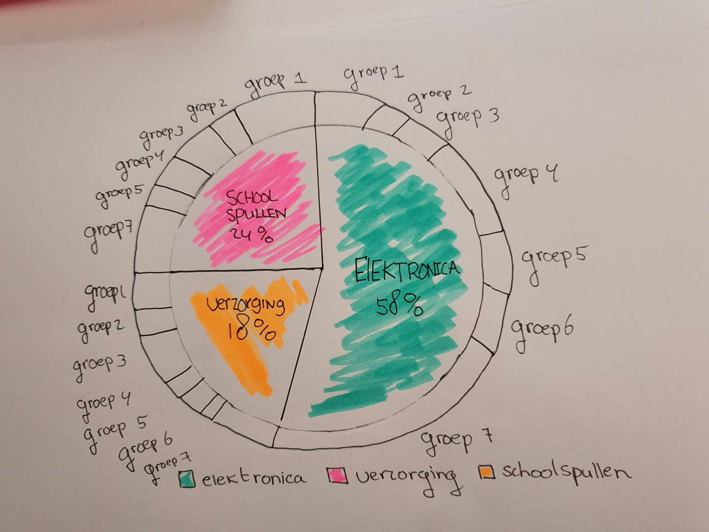

# Categorical graphs/diagrams

**Fig.3 Pie chart van een categorieën diagram**

**Deze grafiek vond ik interessant om te maken omdat het de categorieën ook verder kan onder verdelen in een 2e ring. Het laat zien uit hoeveel deel daarvan bestaat maar ook een bijbehorend encoding die ik ook zou kunnen gebruiken voor de groepen. Het is nog niet helemaal doordacht maar een goede poging.** 

