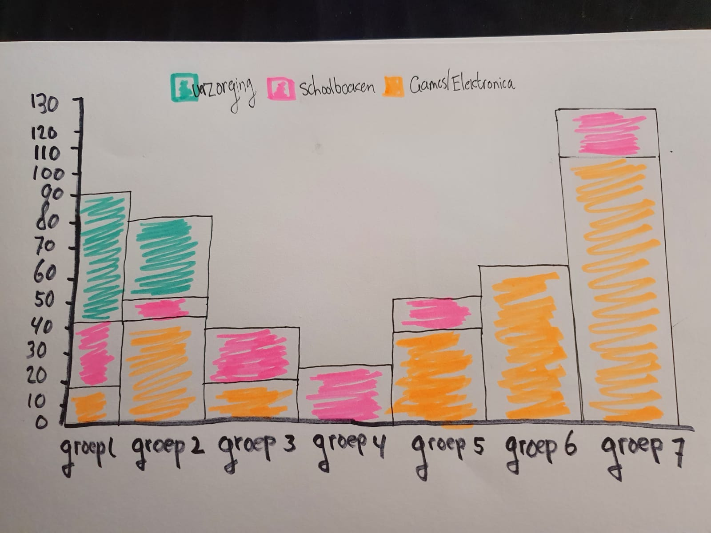

# Categorical graphs/diagrams

 

In de eerste grafiek die ik maak verdeel ik de categorieën in verschillende groepen. Alhoewel ik de verdeling wel beter kan toekennen en groepen specifiek moet maken is dit een eerste idee. 

**Fig.1 Categorische grafiek in thema's** 

**Fig.2 Categorische grafiek in thema's   
  
In de volgende grafiek bepaal ik de categorieën nogmaals en met de prijzen waarvan ik uit kan maken welke het meest duur zijn en die mijn interesses bepalen voor mijn organisatie. Ik koos dit omdat deze grafiek de categorieën goed kan laten zien.**

