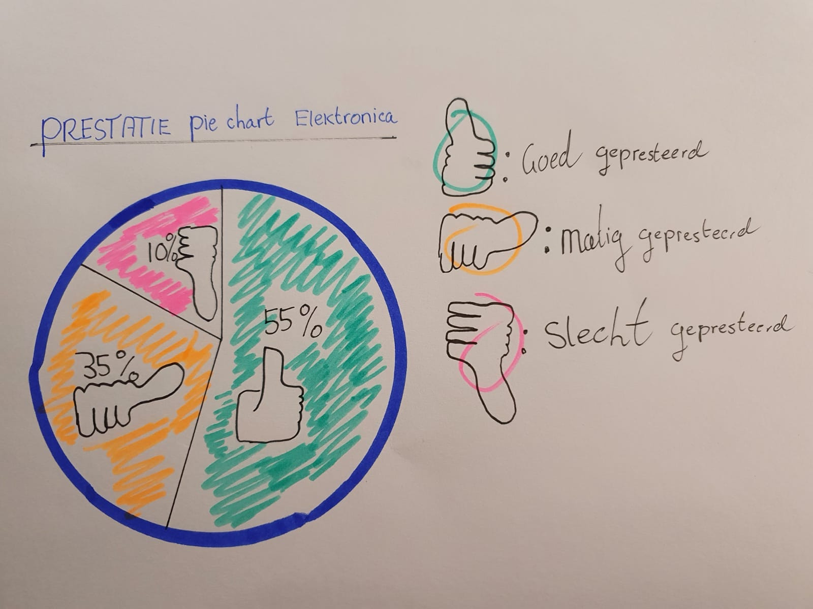

# Hierarchical graphs/diagrams

  **Fig.8 Hierarchical pie chart prioriteit** 

Een grafiek van aankopen van de maanden waarin gekocht en interessant bleken. 

  **Fig.9 Hierarchical pie chart prestatie**

In deze pie chart wou ik de prestatie van de producten laten zien als idee. 

