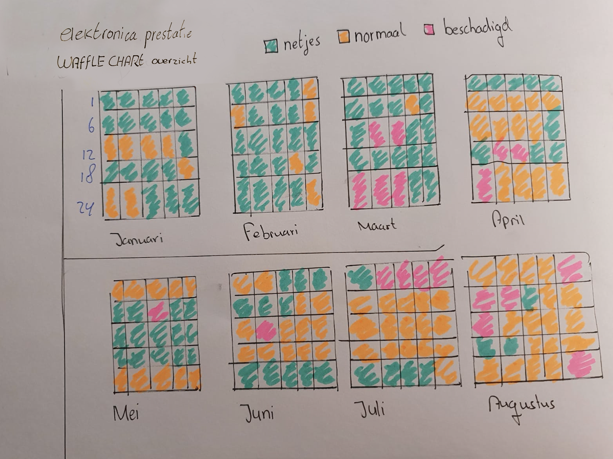

# Hierarchical graphs/diagrams

  **Fig.6 Hierarchical Waffle chart van prestatie/staat**

Met deze grafiek geef ik de staat van mijn categorieën weer 

  **Fig.7 Hierarchical pie chart prioriteit** 

In deze grafiek laat ik zien wat de meest belangrijke categorieën zijn geweest die mijn indeling bepalen. 

