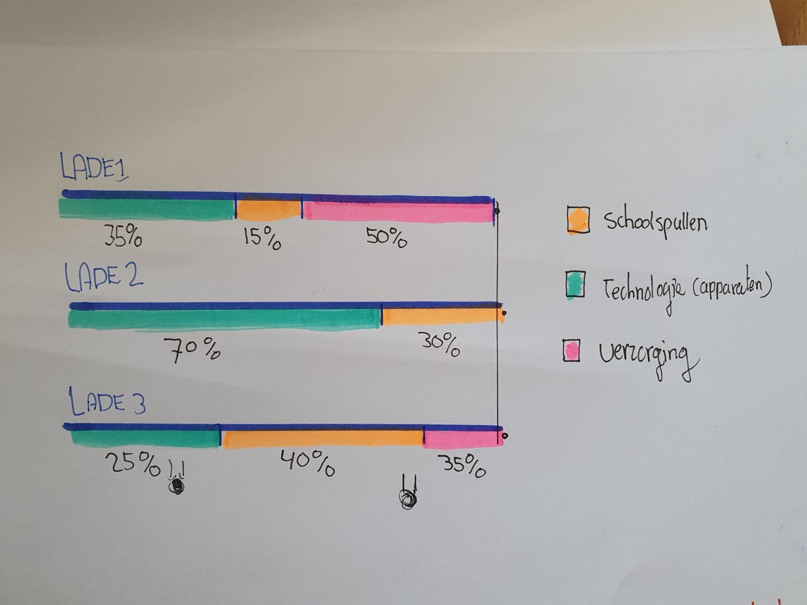

# Hierarchical uitgewerkt

**Fig.2 Hierarchische grafiek van de inhoud en onderverdeling** 

**Pros**  
Leuk overzicht aangezien het een bureaukast als object te gebruiken en vertalen als grafiek  
Laat de relatie en verschillen zien en hoe de indeling beter kan  
Het is duidelijk, niet ingewikkeld om te gebruiken als diagram

**Cons**  
Er zijn niet veel mogelijkheden  
In dit geval zijn de variabelen niet uitdagend  
Heeft niet genoeg connecties 

