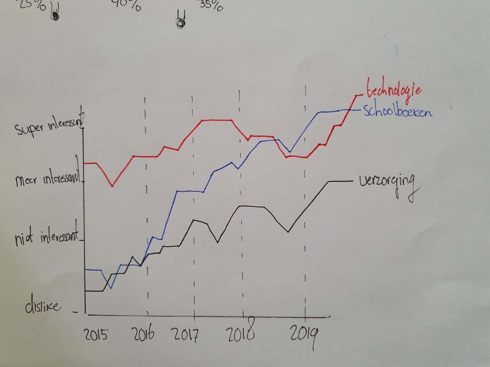

# Temporal uitgewerkt

**Fig.4 Temporal lijngrafiek met ritme**

**Pros**   
Het is overzichtelijk  
Je kunt veel variabelen toevoegen en connecties aangeven  
Stijging en daling van variabelen zijn bruikbaar 

**Cons**   
Het is niet precies of exact ingevuld  
De grafiek kan ingewikkeld worden  

