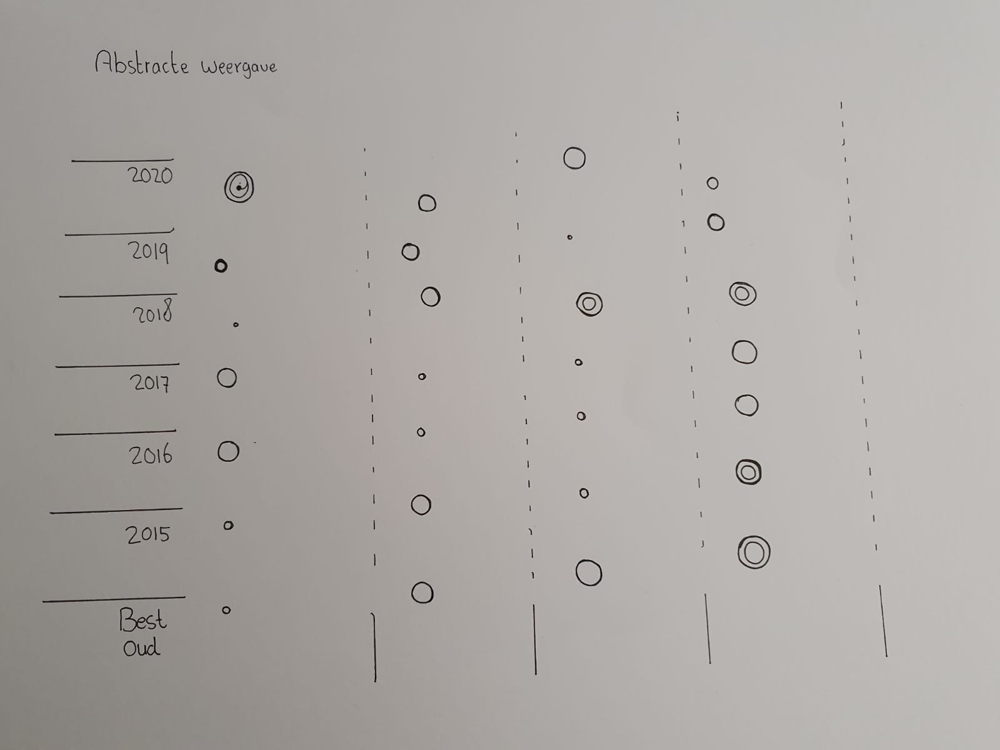

# 2. Abstraheren

Dit is een abstracte weergave van mijn verzameling. De x-as bestaat uit categorieën die ik later bedenk met elk jaar. Dus 2020 heeft een groot deel met schoolspullen bijvoorbeeld. Dit leek mij een goede globale interpretatie van de eerste grafiek die ik zou maken.  

**Fig.2 Abstracte weergave**

