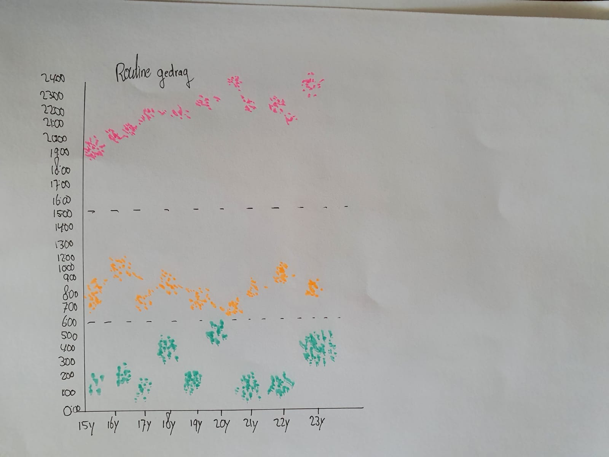

# Relation uitgewerkt

**Fig.3 Relation behaviour mapping overzicht** 

  
**Pros**   
Laat een bepaalde shift zien van op tijd slapen - wakker worden - bezig zijn en opblijven \(vertaald naar organiseren\)  
Kan effectief zijn voor groepen aangeven  
Geeft de onderliggende verbanden aan

**Cons**   
Assen moeten anders verdeeld/ingevuld  
Variabelen kunnen sterker, deze grafiek is niet handig voor mijn doel  

